I'm a fourth-year computer network technician student at SOŠ IT in Banská Bystrica, holding all three Cisco CCNA modules. After school I run my own six-server network across several sites and look after the network of **[Grandify](https://grandify.eu)**, a VPS hosting provider with its own ASN.

### What I'm running

**[Grandify](https://grandify.eu)**: lead network engineer. Own ASN and BGP sessions, an IPv4 /24, Proxmox hosts behind a pair of redundant OPNsense routers.

**Home network**: six servers on several sites tied together with VLANs, OSPF, BGP and VPN tunnels. Proxmox, MikroTik and OPNsense; Zabbix watches it, NetBox documents it.

**[Plan&Ride](https://par.karafa.net)**: co-founder. A free, open-source app for Slovak buses with live departures, a connection planner and bus tracking.

**ARGUS**: my own DNS traffic analyser that spots threats and blocks them on the MikroTik firewall. Python, Flask and Technitium DNS.

**CanSat 2025/26**: deputy team lead of TSA BB, 2nd place in the national round. I ran the server and database, the satellite-to-ground link and the telemetry dashboards in PostgreSQL and Grafana.

**[Lixie StopWatch](https://github.com/karafamichal/lixie-stopwatch)**: Erasmus+ project in Erfurt. I handled the networking, the device logic and getting data onto the display.

### My stack, layer by layer

| Layer | Tools |
| --- | --- |
| Physical | Structured cabling, CCTV and alarm systems, soldering, basic electronics |
| Network | Cisco IOS, MikroTik RouterOS, VLAN, OSPF, BGP, IPv4/IPv6 |
| Security | OPNsense, firewalls, WireGuard, IPsec |
| Systems | Debian, Ubuntu, Proxmox VE, Docker, Windows |
| Observability | Zabbix, Grafana, NetBox, Uptime Kuma |
| Code | Python, SQL, HTML, CSS, JavaScript |

### Get in touch

I'm looking for a part-time IT job near Zvolen or Banská Bystrica, or remote. Write to **[michal@karafa.network](mailto:michal@karafa.network)** or find me at **[karafa.net](https://karafa.net)**.
